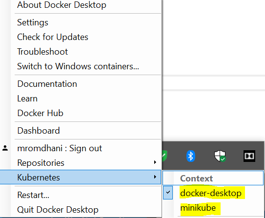
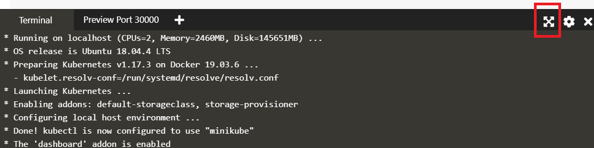
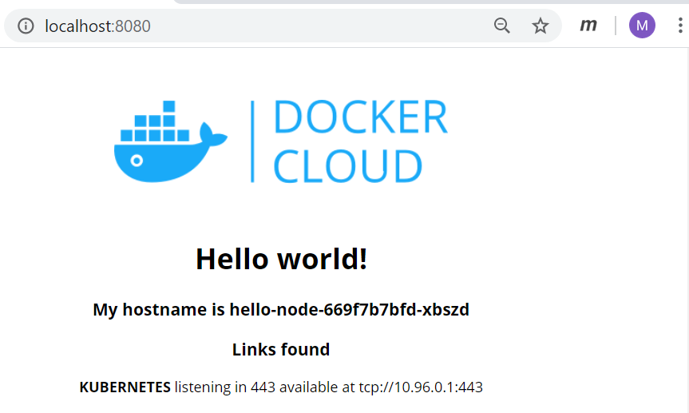
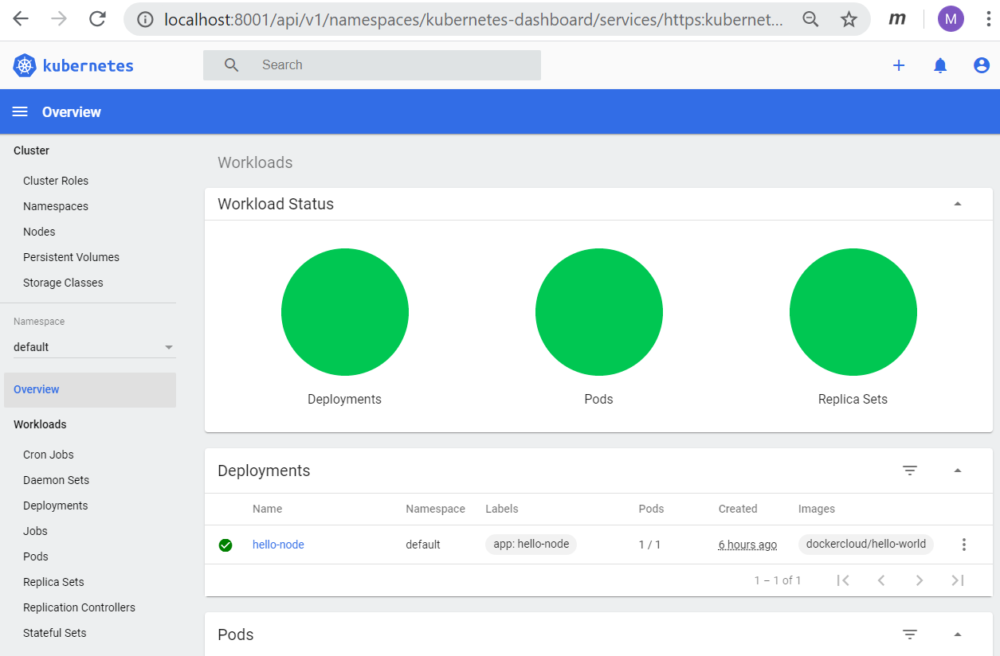

# Lab 01- Understanding the Kubernetes Architecture
---

- [Step 1 - Installing  Kubernetes](#step-1---installing--kubernetes)
  - [1.1 -  Installing Kubernetes Locally Using Docker Desktop for Windows](#11----installing-kubernetes-locally-using-docker-desktop-for-windows)
  - [1.2 - Installing Kubernetes Locally Using Minikube](#12---installing-kubernetes-locally-using-minikube)
    - [_Install kubectl_](#install-kubectl)
    - [_Install Minikube_](#install-minikube)
    - [_Verify the installation of Minikube_](#verify-the-installation-of-minikube)
  - [1.3: Using the Online Kubernernetes Playground](#13-using-the-online-kubernernetes-playground)
- [Step 2 - Exploring your Kubernetes Cluster](#step-2---exploring-your-kubernetes-cluster)
- [Step 3: Deploying your first application](#step-3-deploying-your-first-application)
    - [Create a Deployment](#create-a-deployment)
    - [Create a Service](#create-a-service)
    - [Scale the application](#scale-the-application)
- [Step 4 - Deploying the Kubernetes Dashboard Application](#step-4---deploying-the-kubernetes-dashboard-application)
    - [Deploying the Dashboard UI](#deploying-the-dashboard-ui)
    - [Accessing the Dashboard UI](#accessing-the-dashboard-ui)
- [Step 5 - Building a local multi-nodes cluster using VirtualBox and Vagrant](#step-5---building-a-local-multi-nodes-cluster-using-virtualbox-and-vagrant)
    - [Prerequisites](#prerequisites)
    - [Bringing Up The cluster](#bringing-up-the-cluster)
    - [Useful Vagrant commands](#useful-vagrant-commands)
- [Step 6 - Getting Started with Azure Kubernetes Service (AKS)](#step-6---getting-started-with-azure-kubernetes-service-aks)
    - [Register your Microsoft Azure Pass](#register-your-microsoft-azure-pass)
    - [Get started with Azure Kubernets Service (AKS)](#get-started-with-azure-kubernets-service-aks)


# Step 1 - Installing  Kubernetes

## 1.1 -  Installing Kubernetes Locally Using Docker Desktop for Windows

Since a while, Docker Desktop also comes with built-in support for Kubernetes, meaning that you don't have to install anything special to spin a Kubernetes cluster on your machine.
Once Docker Desktop is up & running, just right click on the icon in the systray and choose **Settings**. You will see a new section called **Kubernetes**. 

 
 
Check the **Enable Kubernetes option**. Docker Desktop will start the process to setup Kubernetes on your machine. This takes few minutes. After the operation is completed, you should see in the lower left corner the message Kubernetes is running marked by a green dot. To make things easier for later, make sure to check also the option **Deploy Docker Stacks to Kubernetes by default**.

Docker Desktop for Windows installs a single node cluster along with the CLI tool **kubectl**.

To verify that Kubernetes is indeed working by opening a command prompt. Feel free to choose the one you like best, like PowerShell or the standard Windows prompt. Enter the following command:

```shell
kubectl cluster-info
Kubernetes master is running at https://kubernetes.docker.internal:6443
KubeDNS is running at https://kubernetes.docker.internal:6443/api/v1/namespaces/kube-system/services/kube-dns:dns/proxy
```
The Kubernetes cluster is indeed up & running. 

To check the version of Kubernetes, enter the following command.
```shell
kubectl version --short
Client Version: v1.16.6-beta.0
Server Version: v1.16.6-beta.0
```
  > Note: **Kubectl Supported version skew**
    kubectl is supported within one minor version (older or newer) of Kubernetes API Server. Example: If Kubernetes Server is 1.16, kubectl is supported at 1.15, 1.16, and 1.17 [https://kubernetes.io/docs/setup/release/version-skew-policy/#kubectl]

List the cluster nodes:
```shell
kubectl get nodes
NAME             STATUS   ROLES    AGE     VERSION
docker-desktop   Ready    master   2d16h   v1.16.6-beta.0
```

List the namespaces:
```shell
kubectl get namespaces
NAME              STATUS   AGE
default           Active   2d16h
docker            Active   2d16h
kube-node-lease   Active   2d16h
kube-public       Active   2d16h
kube-system       Active   2d16h
```

## 1.2 - Installing Kubernetes Locally Using Minikube

Minikube provides a local single-node Kubernetes cluster inside a Virtual Machine (VM) on your laptop/desktop.
The installation instructions for each operation system is provided <https://kubernetes.io/docs/tasks/tools/install-minikube/>. The kubectl CLI tool is not integrated in Minikube, thus you should install it seperately.  

### _Install kubectl_ 
If you have already activated Kubernetes within Docker Desktop for Windows, **Kubectl** is already available. You can use it to communicate with Kubernetes. Otherwise, you can install kubectl according to the instructions in [Install and Set Up kubectl](https://kubernetes.io/docs/tasks/tools/install-kubectl/).

### _Install Minikube_ 
Minikube requires an Hypervisor. If you have already installed Docker Desktop for Windows, **Hyper-V** should be activated already. Othewise, follow these instructions to activate on your Windows (https://msdn.microsoft.com/en-us/virtualization/hyperv_on_windows/quick_start/walkthrough_install). It is possible to use another hypervisor such as [VirtualBox](https://www.virtualbox.org/wiki/Downloads).

* **Install Minikube using an installer executable**
To install Minikube manually on Windows using Windows Installer, download [`minikube-installer.exe`](https://github.com/kubernetes/minikube/releases/latest/download/minikube-installer.exe) and execute the installer.

* **Install Minikube using Chocolatey**
The easiest way to install Minikube on Windows is using [Chocolatey](https://chocolatey.org/) (run as an administrator):

    ```shell
    choco install minikube
    ```
  After Minikube has finished installing, close the current CLI session and restart a new shell nession. Minikube should have been added to your path automatically.

### _Verify the installation of Minikube_ 
To confirm successful installation of both a hypervisor and Minikube, you can run the following command to start up a local Kubernetes cluster. This command should be run as administrator.

```shell
minikube start --vm-driver=hyperv  --kubernetes-version=v1.17.1  # You are supposed to use hyperv hypervisor
<driver_name> can be virtualbox, kvm2, vmware, ... 
```

Once minikube start finishes, run the command below to check the status of the cluster:

```shell
minikube status
```
If your cluster is running, the output from minikube status should be similar to:

```shell
host: Running
kubelet: Running
apiserver: Running
kubeconfig: Configured
```
After you have confirmed whether Minikube is working with your chosen hypervisor, you can continue to use Minikube or you can stop your cluster. To stop your cluster, run:

```shell
minikube stop
```
If you you need to clear minikube's local state:

```shell
minikube delete
```
Now you have two local clustors available on your laptop/desktop : the Docker Desktop Kubernetes Cluster and Minikube. You can list all the clusters using the following command:

```shell
kubectl config get-contexts
CURRENT   NAME                 CLUSTER          AUTHINFO         NAMESPACE
*         docker-desktop       docker-desktop   docker-desktop
          minikube             minikube         minikube
```

To swich from a cluster to another you can do it either using the Docker System Tray.

 

Or using the kubectl CLI.

```shell
kubectl config use-context docker-desktop
```

## 1.3: Using the Online Kubernernetes Playground

There are several online labs where you can find a free in-browser Kubernetes environment. You could play some scenarios that are configured in these labs:

   -  **Katacoda Playgrounds** : 
      - Kubernetes.io's Minikube 
      <https://kubernetes.io/docs/tutorials/kubernetes-basics/create-cluster/cluster-interactive/>       
      - Katacoda courses: <https://www.katacoda.com/courses/kubernetes>
      - Katacoda Playground course : <https://www.katacoda.com/courses/kubernetes/playground> 
   -  **Play with Kubernetes** : 
      - Play with Kubernetes Lab : <https://labs.play-with-k8s.com/>
      - Play with Kubernetes Classroom : <https://training.play-with-kubernetes.com/>

**Task : Expriment Kubernets.io Minikube**
The objective of this task is to experiment the free in-browser Kubernetes.io Minikube. This environment  is based on the Katacoda Playground.
- Navigate to the playground link: <https://kubernetes.io/docs/tutorials/kubernetes-basics/create-cluster/cluster-interactive/> and Click **Start Scenario**. Follow the steps to start `Minikube` and to experiment the getting started commands.

- Maximize the terminal as illustrated in the figure below and experiment the following commands:
```shell
kubectl cluster-info
kubectl version --short
```  



# Step 2 - Exploring your Kubernetes Cluster

In this step, we will explore various components of Kubernetes Cluster.

**Tasks**
- Explorer the Kubectl Context and Configuration using the following commands:

```shell
kubectl config view           # Show Merged kubeconfig settings.
kubectl config view -o jsonpath='{.users[*].name}'   # get a list of users
kubectl config get-contexts                          # display list of contexts 
kubectl config current-context                       # display the current-context
```
- Explore the Kubernetes Context using the following commands
```shell
kubectl cluster-info         # Display addresses of the master and services
kubectl cluster-info dump    # Dump current cluster state to stdout
```
- Explore the existing resources
```shell
kubectl get nodes            # List all cluster nodes
kubectl get namespaces       # List all the namespaces
kubectl get deployments      # List all the namespaces in the default namespace
kubectl get services         # List all the services in the default namespace
kubectl get pods             # List all the pods in the default namespace
kubectl get deployments --all-namespaces     # List all the namespaces in all namespaces
kubectl get all --all-namespaces     # List all the resources in all namespaces
```

# Step 3: Deploying your first application

### Create a Deployment

Deployments are the recommended way to manage the creation and scaling of Pods. A Kubernetes Pod is a group of one or more Containers, tied together for the purposes of administration and networking. The Pod in this step has only one Container. A Kubernetes Deployment checks on the health of your Pod and restarts the Pod's Container if it terminates. 

- Use the `kubectl create` command to create a Deployment that manages a Pod. The Pod runs a Container based on the provided Docker image.

```shell
kubectl create deployment hello-kubernetes --image=dockercloud/hello-world
```
- View the Deployment:

```shell
kubectl get deployments
```
- View the Pod:

```shell
kubectl get pods
```
We can easily see this if we try to terminate the pod with the following command:

```shell
kubectl delete pods hello-kubernetes-779db5df9f-227hk
pod "hello-kubernetes-779db5df9f-227hk" deleted
 ```
Now try again to see the list of pods. If you're fast enough, you should see something like this:

```shell
kubectl get pods
NAME                        READY   STATUS              RESTARTS   AGE
hello-kubernetes-cfd4bd475-8mv2x   0/1     ContainerCreating   0          3s
```
As you can see, Kubernetes is already creating a new pod. If we try again in a few seconds, we'll see our pod back in the Running status. Can you understand what just happened? The deployment has specified a desired state of a single instance of our webserver application always up & running. As soon as we have killed the pod, Kubernetes has realized that the desired state wasn't respected anymore and, as such, it has created a new one. Smart, isn't it?

### Create a Service
By default, the Pod is only accessible by its internal IP address within the Kubernetes cluster. To make the container accessible from outside the Kubernetes virtual network, you have to expose the Pod as a Kubernetes Service.

- Expose the Pod to the public internet using the kubectl expose command:

```shell
kubectl expose deployment hello-kubernetes --type=LoadBalancer --port=8080 --target-port=80
```
The `--type=LoadBalancer` flag indicates that you want to expose your Service outside of the cluster.

View the Service you just created:

```shell
kubectl get services
```
The output is similar to:
```shell
NAME               TYPE           CLUSTER-IP      EXTERNAL-IP   PORT(S)          AGE
hello-kubernetes   LoadBalancer   10.98.98.14     localhost     8080:31099/TCP   7m
```
Since we have specified LoadBalancer as type, Kubernetes will automatically assign an external IP, other than an internal IP, to our application. Since Kubernetes is running on our own machine, the external IP will be the localhost. As such, we can open a browser and type <http://localhost:8080> to see the landing page of the web application displayed:



### Scale the application
What if we want to scale our application up? The nice part of Kubernetes is that, exactly like what happened when we have killed the pod, we don't have to manually take care of creating / deleting the pods. We just need to specify which is the new desired state, by updating the definition of the deployment. For example, let's say that now we want 5 instances of hello-kubernetes to be always up & running. We can use the following command:

kubectl scale deployments webserver --replicas=5
deployment.extensions/webserver scaled
Now let's see again the list of available pods:

```shell
kubectl get pods
NAME                        READY   STATUS    RESTARTS   AGE
hello-kubernetes-cfd4bd475-8mv2x   1/1     Running   0          17m
hello-kubernetes-cfd4bd475-jgll4   1/1     Running   0          51s
hello-kubernetes-cfd4bd475-rjbfq   1/1     Running   0          51s
hello-kubernetes-cfd4bd475-v7jd4   1/1     Running   0          51s
hello-kubernetes-cfd4bd475-z9dqt   1/1     Running   0          51s
```
Now we have 5 pods up & running: the first one is the original one (you can notice it by the age, it's the oldest one), while the other four have been created as soon as we have updated the definition of the desired state of hello-kubernetes deployment. However, thanks to the service we have previously created, our web application is still exposed through a single endpoint:

```shell
kubectl get services
NAME               TYPE           CLUSTER-IP      EXTERNAL-IP   PORT(S)          AGE
hello-kubernetes   LoadBalancer   10.101.160.91   localhost     8080:31151/TCP   85m
kubernetes         ClusterIP      10.96.0.1       <none>        443/TCP          93m
```

# Step 4 - Deploying the Kubernetes Dashboard Application

Dashboard is a web-based Kubernetes user interface. You can use Dashboard to deploy containerized applications to a Kubernetes cluster, troubleshoot your containerized application, and manage the cluster resources. You can use Dashboard to get an overview of applications running on your cluster, as well as for creating or modifying individual Kubernetes resources (such as Deployments, Jobs, DaemonSets, etc). 

### Deploying the Dashboard UI 

The Dashboard UI is not deployed by default. To deploy it, run the following command:

```shell
kubectl apply -f https://raw.githubusercontent.com/kubernetes/dashboard/v2.0.0/aio/deploy/recommended.yaml
```

### Accessing the Dashboard UI 

To protect your cluster data, Dashboard deploys with a minimal authentication by default. Currently, Dashboard only supports logging in with a Bearer Token.  The UI can only be accessed from the machine where the command is executed. 
You can access Dashboard using the kubectl command-line tool by running the following command:

```shell
kubectl proxy
```
Kubectl will make Dashboard available at <http://localhost:8001/api/v1/namespaces/kubernetes-dashboard/services/https:kubernetes-dashboard:/proxy/>.
You will then be prompted with this page, to enter the credentials:


To get the token type in the following command:
```shell
kubectl -n kubernetes-dashboard describe secret default
```
The dashboard UI is then displayed 




 > **Note**: You may be tempted to simply set type: `LoadBalancer` on the dashboard service. Don't do this! This will (usually) make your dashboard accessible to the world. With a well functioning cluster with RBAC this isn't an immediate disaster but it is still not advised. The easiest and most common way to access the dashboard is through `kubectl proxy`. This creates a local web server that securely proxies data to the dashboard through the Kubernetes API server. Read more [here](https://blog.heptio.com/on-securing-the-kubernetes-dashboard-16b09b1b7aca).


# Step 5 - Building a local multi-nodes cluster using VirtualBox and Vagrant

This construction of the vluster is based on a `Vagrantfile` for the provisioning of 3 nodes Kubernetes cluster (1 master and 2 worker nodes) using `VirtualBox` and `Ubuntu 16.04`.

### Prerequisites

You need the following installed to use this playground.

- `Vagrant`, version 2.2 or better.
- `VirtualBox`, tested with Version 6.0
- Internet access, this playground pulls Vagrant boxes from the Internet as well
as installs Ubuntu application packages from the Internet.

### Bringing Up The cluster

To bring up the cluster, change into the directory containing the Vagrantfile `unit-01-understanding K8s architecture\multi-nodes-local-cluster` and `vagrant up` !

```bash
cd k8s-playground
vagrant up
```

Vagrant will start three machines. Each machine will have a NAT-ed network
interface, through which it can access the Internet, and a `private-network`
interface in the subnet 192.168.205.0/24. The private network is used for
intra-cluster communication.

The machines created are:

| NAME | IP ADDRESS | ROLE |
| --- | --- | --- |
| k8s-head | `192.168.205.10` | Cluster Master |
| k8s-node-1 | `192.168.205.11` | Cluster Worker |
| k8s-node-2 | `192.168.205.12` | Cluster Worker |

As the cluster brought up the cluster master (**k8s-head**) will perform a `kubeadm init` and the cluster workers will perform a `kubeadmin join`.

### Useful Vagrant commands

```bash
#Create the cluster or start the cluster after a host reboot
vagrant up

#Execute provision in all the vagrant boxes
vagrant provision

#Execute provision in the Kubernetes node 1
vagrant provision k8s-node-1

#Open an ssh connection to the Kubernetes master
vagrant ssh k8s-head

#Open an ssh connection to the Kubernetes node 1
vagrant ssh k8s-node-1

#Open an ssh connection to the Kubernetes node 2
vagrant ssh k8s-node-2

#Stop all Vagrant machines (use vagrant up to start)
vagrant halt

#Destroy the cluster
vagrant destroy -f
```

# Step 6 - Getting Started with Azure Kubernetes Service (AKS)

 Azure Kubernetes Service (AKS) makes it simple to deploy a managed Kubernetes cluster in Azure. AKS reduces the complexity and operational overhead of managing Kubernetes by offloading much of that responsibility to Azure. As a hosted Kubernetes service, Azure handles critical tasks like health monitoring and maintenance for you. The Kubernetes masters are managed by Azure. You only manage and maintain the agent nodes. As a managed Kubernetes service, AKS is free - you only pay for the agent nodes within your clusters, not for the masters.

 ### Register your Microsoft Azure Pass

- Go to <https://www.microsoftazurepass.com/>. Login and redeem your Azure Pass.

### Get started with Azure Kubernets Service (AKS)

- Optional Instalation : Install the Azure CLI. It is provided in training tools. You can also download it from <https://aka.ms/installazurecliwindows>. Its installation process is straighforward. This installation is optional because you Azure provides an Azure Cloud cloud that has `kubetcl` and allthe required tooling. 
   
-  Walk through this guided quichstart tutorial : [Quickstart: Deploy an Azure Kubernetes Service cluster using the Azure CLI](https://docs.microsoft.com/en-us/azure/aks/kubernetes-walkthrough). At the end, you should be familiar to work with the Azure Kubernetes (AKS) and able to deploy applications on AKS.   