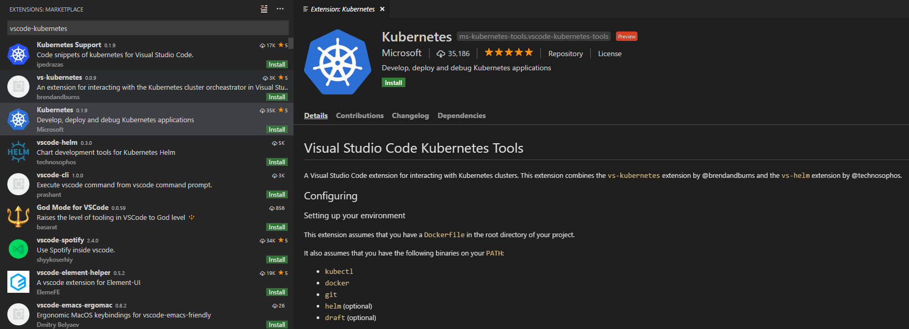
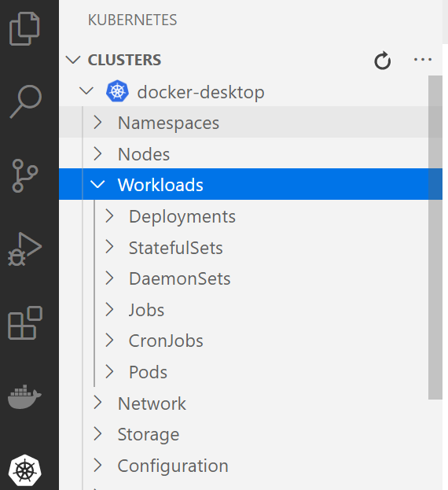
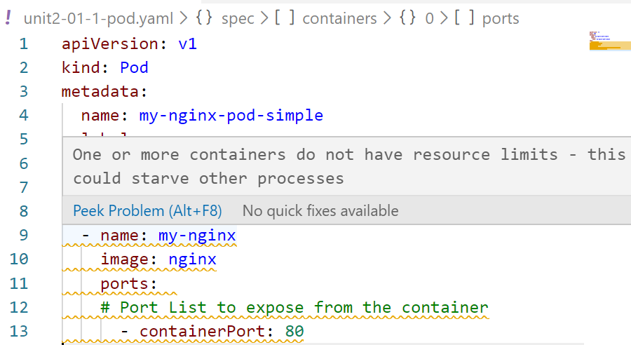

# Lab 02- Deploying applications
---

### Lab Steps

- [Step 1 - Deploying with Kubectl](#step-1---deploying-with-kubectl)
  - [1.1 -  Deploying Pods](#11---deploying-pods)
  - [1.2 -  Deploying Replica Sets](#12---deploying-replica-sets)
  - [1.3 -  Working with deployments](#13---working-with-deployments)
- [Step 2 - Deploying with Yaml](#step-2---deploying-with-yaml)
  - [2.1- Editing Yaml Manifests with VS Code](#21--editing-yaml-manifests-with-vs-code)
  - [2.2 - Deploying Pods using Yaml](#22---deploying-pods-using-yaml)
  - [2.3 - Deploying a Pod having a Side Car Container](#23---deploying-a-pod-having-a-side-car-container)
  - [2.4 - Deploying Replica Sets](#24---deploying-replica-sets)
  - [2.5 - Working with Deployments](#25---working-with-deployments)
- [Step 3 - Managing resources for Containers and Pods](#step-3---managing-resources-for-containers-and-pods)
- [Step 4 - Rolling out and Rolling back Deployments](#step-4---rolling-out-and-rolling-back-deployments)
- [Step 5 - Implementing Rollout Strategies](#step-5---implementing-rollout-strategies)
- [Step 6 - Deploying Deamon Sets](#step-6---deploying-deamon-sets)


# Step 1 - Deploying with Kubectl
There are two basic ways to deploy to Kubernetes: **imperatively**, with the many `kubectl` commands, or **declaratively**, by writing manifests and using `kubectl apply`. The former is good for learning and interactive experimentation (analogous to a programming language's REPL); the latter is good for reproducible deployments, i.e., for production — though you may still use some kubectl commands for debugging in production.
Kubernetes objects can quickly be created, updated, and deleted directly using imperative commands built into the `kubectl` command-line tool. 
- **Kubectl : Creating objects**

  |Commands   |      Effects      |  
  |----------|-------------|
  | `run` | Create a new Deployment object to run Containers in one or more Pods | 
  |`expose` |   Create a new Service object to load balance traffic across Pods   |  
  | `autoscale` | Create a new Autoscaler object to automatically horizontally scale a controller, such as a Deployment |    

- **Kubectl : Update operations**

  |Commands   |      Effects      |  
  |----------|-------------|
  | `scale` | Horizontally scale a controller to add or remove Pods by updating the replica count of the controller | 
  |`annotate` |   Add or remove an annotation from an object   |  
  | `label` | Add or remove a label from an object |
  | `set <field>` | Set an aspect of an object |  

- **Kubectl : Live Object Updates**

  |Commands   |      Effects      |  
  |----------|-------------|
  | `edit` | Directly edit the raw configuration of a live object by opening its configuration in an editor | 
  |`patch` |   Directly modify specific fields of a live object by using a patch string   |  

- **Kubectl : Deleting objects**

  |Commands   |      Effects      |  
  |----------|-------------|
  | `delete <type>/<name>` | Delete an object from a cluster | 

- **Kubectl : Viewing objects**

  |Commands   |      Effects      |  
  |----------|-------------|
  | `get` | Prints basic information about matching objects | 
  |`describe` |   Prints aggregated detailed information about matching objects  |  
  |`logs` |  Prints the stdout and stderr for a container running in a Pod  |  


## 1.1 -  Deploying Pods
     
- Use `kubectl run `command to create a Pod.

   The following command craetes a pod named `nginx-pod` with image `nginx`.
```shell
kubectl run nginx-pod --generator=run-pod/v1 --image=nginx 
```
This command generates pods that are not bound to a ReplicaSet or Deployment. These are called **Naked Pods**.
The option `--generator=run-pod/v1` specifies the behavior of `Kubectl run` command. If not specified Kubectl generates a deployment rather than a pod. All the generator types are available [here](https://v1-17.docs.kubernetes.io/docs/reference/kubectl/conventions/#generators).
   
   > **Hint**: 
    To scaffold the yaml manifest, use `–o yaml`,-`-dry-run` and output redirection. 
`kubectl run nginx-pod7 --generator=run-pod/v1 --image=nginx  -o yaml --dry-run| Out-File mypod2.yml`

- To verify pod status, use `kubectl get` command as follows
```shell
kubectl get pods
NAME                          READY   STATUS    RESTARTS   AGE
nginx-pod                     1/1     Running   0          9s
```     
Use the `-o wide` option to get more details on pods.
```shell
kubectl get pod -o wide
NAME                          READY   STATUS    RESTARTS   AGE   IP          NODE             NOMINATED NODE   READINESS GATES
nginx-pod                     1/1     Running   0          26s   10.1.0.23   docker-desktop   <none>           <none>
```
There are a few notes to remember about using each of Kubectl commands, whether you use the singular form of an object (e.g., 'pod'), the plural form (e.g., 'pods'), or the shorthand code for an object (e.g., 'po'), the system will gather information about all the matching objects available. To narrow the search down you need to follow the object with name <name>. For example;
```shell
kubectl get pod
kubectl get pods
kubectl get po
```
These three commands will all generate the same outcome. To specify one pod, use the command structure:
```shell
kubectl get po <name>
```
- See the labels of a Pods
```shell
kubectl get pods --show-labels
NAME                          READY   STATUS              RESTARTS   AGE   LABELS
nginx-pod                     0/1     ContainerCreating   0          3s    run=nginx-pod
```
- Add custom label to Pod

   We can add label to Pod using `kubectl label` command.
```shell
kubectl label pod nginx-pod app=frontend
pod/nginx-pod labeled
```
Check that the label has been added to the pod using the command  `kubectl get pods --show-labels`.
-  To delete a pod, use `kubectl delete pod` command as follows:
```shell
kubectl delete pod nginx-pod
pod "nginx-pod" deleted
``` 

## 1.2 -  Deploying Replica Sets

There is no way to create a ReplicaSet using the imperative approach. We should use the declarative approach to create it. However, it is still possible to create the deprecated **Replication Controller** using the imperative approach. Replication controllers simply ensures that the desired number of pods matches its label selector are operational. The Replication Controller is the original form of replication in Kubernetes. It has been replaced by Replica Sets. ReplicaSet have more options for the selector. 
A Deployment that configures a ReplicaSet is now the recommended way to set up replication and that's why Replication controller have been deprecated.

- Create a Replication Controller using the following command:
```shell
kubectl run web-rc --image=nginx --port=80 --generator=run/v1 --replicas=3
```
When running the  previous command, you will be warned, that `kubectl run --generator=run/v1 is DEPRECATED and will be removed in a future version`. 

- Verify the replication controller through describe command.
```shell
kubectl describe replicationcontroller web-rc
Name:         web-rc
Namespace:    default
Selector:     run=web-rc
Labels:       run=web-rc
Annotations:  <none>
Replicas:     3 current / 3 desired
Pods Status:  3 Running / 0 Waiting / 0 Succeeded / 0 Failed
Pod Template:
  Labels:  run=web-rc
  Containers:
   web-rc:
    Image:        nginx
    Port:         80/TCP
    Host Port:    0/TCP
    Environment:  <none>
    Mounts:       <none>
  Volumes:        <none>
Events:
  Type    Reason            Age    From                    Message
  ----    ------            ----   ----                    -------
  Normal  SuccessfulCreate  4m18s  replication-controller  Created pod: web-rc-v852q
  Normal  SuccessfulCreate  4m18s  replication-controller  Created pod: web-rc-bvsqf
  Normal  SuccessfulCreate  4m18s  replication-controller  Created pod: web-rc-mmmfx
```
- Practice the **self healing** feature by forcing the deletion of one pod.
Let's check first the existing pods using `kubectl get` command.
```shell
kubectl get pods
NAME                          READY   STATUS    RESTARTS   AGE
web-rc-bvsqf                  1/1     Running   0          7m17s
web-rc-mmmfx                  1/1     Running   0          7m17s
web-rc-v852q                  1/1     Running   0          7m17s
```
Delete one of the pods. 
```shell
kubectl delete pod web-rc-v852q
```
Check again the existing pods and you will notice that the replication controlled has launched a new one as a replacement of the pod that we have deleted.
```shell
kubectl get pods
NAME                          READY   STATUS    RESTARTS   AGE
web-rc-bvsqf                  1/1     Running   0          7m17s
web-rc-mmmfx                  1/1     Running   0          7m17s
web-rc-wtt78                  1/1     Running   0          18s
```
- Scaling the Pod replicas

   Use the following `kubectl scale` command to increase/decrease the replica set.
```shell
kubectl scale replicationcontroller web-rc --replicas=10  
# You can also use the rc short form for replicationcontroller :  kubectl scale rc web-rc --replicas=10  
```
- Delete a Replication Controller
    
    Use the  `kubectl delete rc` command to delete a  replication controller.
```shell
kubectl delete rc web-rc
``` 

## 1.3 -  Working with deployments

A Deployment provides declarative updates for Pods and ReplicaSets. You describe a desired state in a Deployment, and the Deployment Controller changes the actual state to the desired state at a controlled rate.

- Creating a Deployment

    To create a Deployment use `kubectl run` command as follows.
```shell
kubectl run nginx-deploy --image=nginx --replicas=3
```
The Deployment creates by default the **ReplicaSet** and the **Pods**. Check the name of the Replicaset using `kubectl describe deployment command`. Then, get the details of the Replicaset using the command`kubectl get rs` and the details of the pods using `kubectl get pods`
You probably have notice that the  previous `kubectl run nginx-deploy` command has displayed a warning: `kubectl run --generator=deployment/apps.v1 is DEPRECATED and will be removed in a future version. Use kubectl run --generator=run-pod/v1 or kubectl create instead`. The reason for this depreaction is the vast majority of input parameters for `kubectl run` command is overwhelming for newcomers, as well as for the old timers. It's not that easy to figure out what will be the result of your invocation. Using  explicit `kubectl create` commands is more straightforward.
Let's fix the the warning using `kubectl create`. Run the follwing the command to create a deployment. 
```shell
kubectl create deployment redis-deploy --image=redis
```
With `kubectl create`, you cannot specify the number of replicas. This can be done later using a `kubectl scale` command.
- Scaling a Deployment
 You can scale a Deployment by using the following command:
```
kubectl scale deployment redis-deploy --replicas=10  --record
```
Use the `kubectl get pods` command to check that there are 10 replicas of the redis Pod.

- Updating a Deployment

   Let's update the image of the Deployment. The following command replaces the previous image `alipne:latest` with the  `redis:5` version.
```shell
kubectl set image deployment/redis-deploy redis=redis:5
```
Verify that the image has been updated.
```shell
kubectl describe deploy redis-deploy | findstr Image
```
In order to update the image, you can alternatively edit the Deployment and change `.spec.template.spec.containers[0].image` from `redis:latest` to `redis:5`:
```shell
kubectl edit deployment redis-deploy
```
To see the rollout status, run:
```shell
kubectl rollout status deployment redis-deploy
```
Run `kubectl get rs` to see that the Deployment updated the Pods by creating a new ReplicaSet and scaling it up to 10 replicas, as well as scaling down the old ReplicaSet to 0 replicas.
```shell
kubectl get rs
```
The output is similar to this:
```shell
NAME                       DESIRED   CURRENT   READY   AGE
redis-deploy-55895c5cc4    0         0         0       71m
redis-deploy-6bf89ccd5f    10        10        10      70m
```
- Clean Up
Delete the deployment using the following command :
```
kubectl delete deployment nginx-deploy
```
Check that this will remove the ReplicaSet and the Pods. To do the check,  run `kubectl get rs` and `kubectl get pods`.  

# Step 2 - Deploying with Yaml

## 2.1- Editing Yaml Manifests with VS Code

For fully integrated Kubernetes experience within VS Code, you can install the [Kubernetes Tools extension](https://marketplace.visualstudio.com/items?itemName=ms-kubernetes-tools.vscode-kubernetes-tools), which lets you quickly develop Kubernetes manifests and browse and manage your Kubernetes clusters.  

To install the Kubernetes extension, open the Extensions view (`Ctrl+Shift+X`) and search for "kubernetes". Select the Microsoft Kubernetes extension.



The Kubernetes extension provides autocompletion, code snippets, and verification for the Kubernetes manifest file. For example, once you type 'Deployment', a manifest file with fundamental structure is autogenerated for you. You only need to enter your app name, image, and port manually.

The Kubernetes extension can help you check the status of your application. From the Explorer, click on Workloads, right click on Pods and then choose Get to see whether the application has started. 



To view the status of your app, select Services, right click on your app, and then click Get. The status will be printed to the Integrated Terminal.

## 2.2 - Deploying Pods using Yaml
A Pod is a group of one or more containers with shared storage/network, and a specification for how to run the containers.

After completing this task , you will be able to create Pod declaratively.

- Start VS Code and create a Pod using a YAML file
```shell
code unit2-01-1-pod.yaml  # Use code to launch VS Code from the command line 
```
Enter the following content.
```yaml
apiVersion: v1
kind: Pod
metadata:
  name: my-nginx-pod-simple
  labels:
    name: my-nginx-pod-simple
spec:
  containers:
  - name: my-nginx
    image: nginx
    ports:  
    # Port List to expose from the container    
      - containerPort: 80
```
   > **Note** : Not specifying a port for a container **DOES NOT** prevent that port from being exposed. It is exactly same with Dockerfile EXPOSE instruction !

  In the VS Code editor, you may see yellow under lines within the Yaml `containers` section (cf. the following picture). If you hover over those lines, you will see this message : `One or more containers do not have resource limits ...`

  This message is send by the Kubernetes Linter which is activated by default by the Kubernetes Extension.
  
  
  To fix this warning, either you should either add the specification of resources limits or disable the linter. The right solution would be adding resource limits specification , but for sake of simplicity let's disable the Kubernetes Linter.
   - From VS Code **File** Menu, Select **Preferences**, then **Settings**. 
   - Type `Kubernetes` in the Search bar. When **Vs-Kubernetes** is found, click on the **Edit in settings.json** hyper link. **settings.json** will be opened in the editor.
   -  Locate the  `"vs-kubernetes"` key and add `"disable-linters": ["resource-limits"]` within it.
    ```json
   "vs-kubernetes": {  
       "disable-linters": ["resource-limits"],  // This is the line to Add.
        ...  
    ```
   -  Restart VS Code and you'll notice that the warning has disappered.

- Create the Pod using `kubectl create` command. `kubectl apply`would work also but the `apply` command is intended to update existing resources. It creates the resource if the resource doesn't exist.
  ```shell
    kubectl create -f unit2-01-1-pod.yaml   
  ```
  - View the status of the Pod.
   ```shell
    kubectl get pods -o wide
   ```
- Add a Namespace and a Label to the Pod within the `metada` section of the Pod Yaml manifest.
  ```yaml
      metadata:
        name: my-nginx-pod
        namespace: default
        labels:
          name: my-nginx-pod 
          profile: dev
  ```
  - Apply the new configuration using `kubectl apply` command. 
  - Check that the new label has been added to the Pod configuration. Hint:  Use `kubectl describe pod my-nginx-pod` or ` kubectl get pod my-nginx-pod --show-labels`.
  - Test the Pod. Implement a simple port forwarding in order to access to the pod. 
```shell
  kubectl port-forward my-nginx-pod 8080:80
```   
  - Curl the Pod or connect to it using your web browser. The URL to connected to is http://localhost:8080 
```shell
  curl.exe http://localhost:8080
``` 
  - Clean Up. Stop the port-forwading by issuing a `CTRL-C` from within its terminal. Delete the Pod using the `kubectl delete pod my-nginx-pod` command.


  ## 2.3 - Deploying a Pod having a Side Car Container

  In the previous example, we have deployed a single container Pod. While this is likely the most common way to deploy pods, there are several situations where a pod will package more that one container. Sidecar containers is a pattern where the so-called sidecar container is there to "help" the main container. Some examples include log or data change watchers, monitoring adapters, and so on. This ensures some kind of seperation of concerns. 
  
  There are several other patterns for multi-container pods like Proxies and Adapters. For example, Apache HTTP server or nginx can act as a reverse proxy to a web application in the main container to log and limit HTTP requests.
  After completing this task , you will be able to create Pod having two containers: a main container and a side-car container.
  
 - Edit a new YAML file and name it `unit2-01-2-pod-with-sidecar.yaml`. Initialize it with the following content :
    ```yaml
    apiVersion: v1
    kind: Pod
    metadata:
      name: pod-with-sidecar
    spec:
      # Create a volume called 'shared-logs' that the app and sidecar share
      volumes: 
      - name: shared-logs
        emptyDir: {}
      containers:
      # Main application container
      - name: app-container
        image: alpine
        volumeMounts:
        - name: shared-logs
          mountPath: /html
        command: ["/bin/sh", "-c"]
        args:
          - while true; do
              echo "$(date) <br/>" >> /html/index.html;
              sleep 2;
            done
      # Sidecar container
      - name: sidecar-container
        image: nginx
        volumeMounts:
        - name: shared-logs
          mountPath: /usr/share/nginx/html
    ```
    
- Create the Pod using the following command
```shell
  kubectl create -f unit2-01-2-pod-with-sidecar.yaml
```
  - Check that the pod has been created: Use ` kubectl get pods pod-with-sidecar`. Check that the Pod contains two containers : Use `kubectl describe pod-with-sidecar` command.  
- Test the Pod. Implement a simple port forwarding in order to access to the pod. 
```shell
  kubectl port-forward pod-with-sidecar 8080:80
```   
  - Curl the Pod or connect to it using your web browser. The URL to connected to is http://localhost:8080 
```shell
  curl.exe http://localhost:8080
``` 
- Clean Up. Stop the port-forwading by issuing a `CTRL-C` from within its terminal. Delete the Pod using the `kubectl delete pod pod-with-sidecar` command.

## 2.4 - Deploying Replica Sets
- Create a Replicaset by editing a new YAML file. Name it `unit2-02-replicaset.yaml`. Initialize it with the following content :
```yaml
apiVersion: apps/v1
kind: ReplicaSet
metadata:
  name: hello-rs
  labels:
    app: hello-rs
    tier: frontend
spec:  
  replicas: 3 # modify replicas according to your case
  selector:
    matchLabels:
      tier: frontend
  template:
    metadata:
      labels:
        tier: frontend
    spec:
      containers:
        - name: hello-container
          image:  dockercloud/hello-world
```
Let's examine the definition file that was used to create our ReplicaSet:

 - The apiVersion for this object is currently `app/v1`
 - The kind of this object is `ReplicaSet`
 - In the metadata part, we define the name by which we can refer to this ReplicaSet. We also define a number of labels through which we can identify it.
 - The spec part is mandatory in the ReplicaSet object. It defines:
    - The number of replicas this controller should maintain. It default to 1 if it was not specified.
    - The selection criteria by which the ReplicaSet will choose its pods. _Be careful not to use a label that is already in use by another controller_. Otherwise, another ReplicaSet may acquire the pod(s) first. Also notice that the labels defined in the pod template (spec.template.metadata.label) cannot be different than those defined in the matchLabels part (spec.selector).
   - The pod template is used to create (or recreate) new pods. It has its own metadata, and spec where the containers are specified. You can refer to our article for more information about pods.

- Create the ReplicaSet using  the following command :
```shell
 kubectl create -f unit2-02-replicaset.yaml
```  
  - Check that the pod has been created: Use  `kubectl get rs`. Check that the 3 pods have been created: Use `kubectl get pods` command.  
- Test the ReplicaSet. Expose a simple service in order to load balance the requests to the pods. 
```shell
  kubectl expose rs hello-rs --type=LoadBalancer --port=9090 --target-port=80
```   
  - Connect to the Replicaset using your web browser. The URL to connected to is http://localhost:9090. Refresh the browser many times, you will notice that the hostname reported by the application is cycling from one pod to another. 

- Clean Up. Delete the Replicast using the `kubectl delete rs hello-rs` command. Delete the service using `kubectl delete svc hello-rs`.

## 2.5 - Working with Deployments

In the previous example, have deployed a ReplicaSet. However, ReplicaSet do not enable Rollover and Rollback functionnality. Additionnally, once you select the pods that are managed by a ReplicaSet, you cannot change their pod templates. For example, if you are using a ReplicaSet to deploy four pods running and you want to change the image to a newer version, you need to delete the ReplicaSet and recreate i.

A Deployment resource uses a ReplicaSet to manage the pods. However, it handles updating them in a controlled way. 
- Create a Deployment by editing a new YAML file. Name it `unit2-03-deployment.yaml`. Initialize it with the following content :
```yaml
apiVersion: apps/v1
kind: Deployment
metadata:
  name: nginx-app-deploy
  labels:
    app: nginx-app-deploy
spec:
  replicas: 3
  selector:
    matchLabels:
      app: nginx
  template:
    metadata:
      labels:
        app: nginx
    spec:
      containers:
        - name: nginx-container
          image: nginx
```
- Create the Deployment using  the following command :
```shell
 kubectl create -f unit2-03-deployment.yaml
```  
  - Check that the deployment has been created: Use the `kubectl get deployments` command. 
  - Check that the ReplicaSet and the 3 pods are been created: Use the `kubectl get rs` command.
  - Check that the 3 pods have been created: Use the `kubectl get pods` commands.  
- Test the deployment. Expose a simple service in order to load balance the requests to the pods. 
```shell
  kubectl expose deployment nginx-app-deploy --type=LoadBalancer --port=9089 --target-port=80
```   
  - Connect to the application using your web browser. The URL to connected to is http://localhost:9089. You will see the nginx welcome page.

- Scaling a Deployment
  - Change the replicas attribute in the Yaml manifest `unit2-03-deployment.yaml`  and set its value to `5` and save the file.
  ```yaml
  replicas: 5   # 5 replaces the old value (3)
  ```
  - Apply the update of the deployment using the following command:
  ```
  kubectl apply -f unit2-03-deployment.yaml --record
  ```
  - Verify that there are 5 replicas of the nginx Pod. For this, use the `kubectl get pods` command. 

- Updating a Deployment

   - Let's update the image of the Deployment. Change the image attribute in the Yaml  manifest `unit2-03-deployment.yaml` and set its value to `nginx:1.15` and save the file.
    ```
      image: nginx:1.15
    ```
   - Apply the update of the deployment using the following command:
   ```
   kubectl apply -f unit2-03-deployment.yaml --record
   ```
   - Verify that the image has been updated.
    ```shell
    kubectl describe deploy nginx-app-deploy | findstr Image
    ```
   - You can alternatively update the image using the interactive command `kubectl edit deployment` or `kubectl set image`. We have already practiced these commands in section 1.3.

- Clean Up 

 Delete the Deployment using the `kubectl delete rs nginx-app-deploy` command. Delete the service using `kubectl delete svc nginx-app-deploy`. Check that this will remove the ReplicaSet and the Pods. To do the check,  run `kubectl get rs` and `kubectl get pods`. 

# Step 3 - Managing resources for Containers and Pods
By default, containers run with unbounded compute resources on a Kubernetes cluster. With resource quotas, cluster administrators can restrict resource consumption and creation on a namespace basis.  

As a cluster administrator, you might want to impose restrictions on resources that Pods can use. When you specify a Pod, you can optionally specify how much of each resource a Container needs. The most common resources to specify are CPU and memory (RAM). These resources play a critical role in how the scheduler allocate pods to nodes.
Kubernetes uses the requests & limits structure to control resources such as CPU and memory.
  - **Requests** are what the container is guaranteed to get. For example, If a container requests a resource, Kubernetes will only schedule it on a node that can give it that resource.
  - **Limits**, on the other hand, is the resource threshold a container never exceed. The container is only allowed to go up to the limit, and then it is restricted.

Let's specify resources for the ngix container. For example, we specify a request of `0.25 cpu` and `64MiB` (64* 2 exp(20) bytes) of memory and a limit of `0.5 cpu` and `256MiB` of memory.

- Create a Deployment by editing a new YAML file. Name it `unit3-04-limit-resources.yaml`. Initialize it with the following content :

  ```yaml
  apiVersion: apps/v1
  kind: Deployment
  metadata:
    name: nginx-app-limits
    labels:
      app: nginx-app-limits
  spec:
    replicas: 3
    selector:
      matchLabels:
        app: nginx-app-limits
    template:
      metadata:
        labels:
          app : nginx-app-limits
      spec:
        containers:
          - name: nginx
            image: nginx
            resources:
              requests: # Initial requests
                cpu: "250m" # Equivalent to 0.25 CPU (Quater CPU)
                memory: "64Mi" # Equivalent to 64 * 2 of power(20)             
              limits:  # Hard limits
                cpu: "500m"
                memory: "256Mi"              
  ```
- Check that these resource limits are taken into account. Get the list of pods using `kubectl get pods`. Then, get the detailed descrition of one of the pods using the `kubectl describe pod [pod_name]`.  
- Clean Up. Delete the Deployment using the `kubectl delete deployment nginx-app-limits`
- Create a **LimitRange** and a Pod
There is a concern that one Pod or Container could monopolize all available resources. A LimitRange is a policy to constrain resource allocations (to Pods or Containers) in a namespace.
  - Create a namespace called `constraints-mem-example`
```shell
  kubectl create namespace constraints-mem-example
```
  - Create a LimitRange specification in a file named `unit2-05-limit-range.yaml`.
    ```yaml
    apiVersion: v1
    kind: LimitRange
    metadata:
      name: mem-min-max
    spec:
      limits:
      - max:
          memory: 1Gi
        min:
          memory: 500Mi
        type: Container
    ```
  - Apply the LimitRange to the namespace `constraints-mem-example`:
    ```shell
      kubectl apply -f unit2-05-limit-range.yaml --namespace=constraints-mem-example  
    ```
  - View detailed information about the LimitRange:
    ```
      kubectl get limitrange mem-min-max --namespace=constraints-mem-example --output=yaml
    ```
- Attempt to create a Pod that exceeds the maximum memory constraint
  - Create a new Yaml manifest for a Pod that has one Container. The Container specifies a memory request of `800 MiB` and a memory limit of `1.5 GiB`.  Named it `unit2-06-pod-exceeding-range.yaml` and initialize it as follows:
    ```yaml
    apiVersion: v1
    kind: Pod
    metadata:
      name: constraints-mem-exceeding
    spec:
      containers:
      - name: constraints-mem-exceeding
        image: nginx
        resources:
          limits:
            memory: "1.5Gi"
          requests:
            memory: "800Mi"
    ```
  - Attempt to create the Pod:  
  ```shell
  kubectl apply -f unit2-06-pod-exceeding-range.yaml --namespace=constraints-mem-example
  ```
  The output shows that the Pod does not get created, because the Container specifies a memory limit that is too large:
  ```shell
  Error from server (Forbidden): error when creating "unit2-06-pod-exceeding-range.yaml": pods "constraints-mem-exceeding" is forbidden: maximum memory usage per Container is 1Gi, 
  but limit is 1536Mi
  ```
- Clean Up. Delete the the Pod, The LimiRange, and the NameSpace objects.
  ```
  kubectl delete pod constraints-mem-exceeding  --namespace=constraints-mem-example
  kubectl delete limitrange mem-min-max --namespace=constraints-mem-example
  kubectl delete ns constraints-mem-example
  ```

# Step 4 - Rolling out and Rolling back Deployments

- Rollout a Deployment

 Let's recreate the application `nginx-app-deploy` described in previous section and having the `unit2-03-deployment.yaml` file.
  ```
    kubectl create -f unit2-03-deployment.yaml --record
  ```  
 Let's practice a rollout by setting the replicas to `10` and setting the `nginx` image to the `nginx:1.18` version.  
    ```
      replicas: 10
      ...
      image: nginx:1.18
    ```
  - Apply the rollout of the application using the following command:
   ```
   kubectl apply -f unit2-03-deployment.yaml --record
   ```
  - You can view the rollout status using the command:
    ```shell
    kubectl rollout status deployment/nginx-app-deploy
    deployment "nginx-app-deploy" successfully rolled out
    ```
  - You can view the rollout history using the command:
    ```shell
    kubectl rollout history deployment/nginx-app-deploy
    REVISION  CHANGE-CAUSE
    1         kubectl.exe create --filename=.\unit2-03-deployment.yaml --record=true
    2         kubectl.exe apply --filename=.\unit2-03-deployment.yaml --record=true
    ```
  - To inspect the details of a given revision, run:
  ```shell
  kubectl rollout history deployment/nginx-app-deploy --revision=2
  ```
- Rolling Back a Deployment

   Sometimes, you may want to rollback a Deployment; for example, when the Deployment is not stable, such as crash looping. By default, all of the Deployment's rollout history is kept in the system so that you can rollback anytime you want (you can change that by modifying revision history limit).

  - Suppose that you made a typo while updating the Deployment, by putting the image name as `nginx:1.77` instead of `nginx:1.7`.

   ```shell
  kubectl set image deployment/nginx-app-deploy nginx-container=nginx:1.77 --record=true
  ```
  - The rollout gets stuck. You can verify it by checking the rollout status:
  ```shell
  kubectl rollout status deployment/nginx-app-deploy
  ```
The output is similar to this:
```shell
Waiting for deployment "nginx-app-deploy" rollout to finish: 5 out of 10 new replicas have been updated...
```
Press Ctrl-C to stop the above rollout status watch.
  - Look at the ReplicaSets. There are only ready 8 replicas in the previous replicaset, while no replicas are ready from the new replicaset. 
```shell
kubectl get rs
NAME                          DESIRED   CURRENT   READY   AGE
nginx-app-deploy-6dcc4bf49d   0         0         0       7m32s
nginx-app-deploy-77b4db474f   5         5         0       55s
nginx-app-deploy-868755f86b   8         8         8       7m9s
```
- Looking at the Pods created, you see that 5 Pods created by new ReplicaSet is stuck in an image pull loop.
```shell
kubectl get pods
```
The output is similar to this:
```shell
NAME                                READY   STATUS             RESTARTS   AGE
nginx-app-deploy-77b4db474f-4vsws   0/1     ImagePullBackOff   0          2m53s
nginx-app-deploy-77b4db474f-5xn8b   0/1     ImagePullBackOff   0          2m53s
nginx-app-deploy-77b4db474f-fpd62   0/1     ImagePullBackOff   0          2m53s
nginx-app-deploy-77b4db474f-g4j9l   0/1     ImagePullBackOff   0          2m53s
nginx-app-deploy-77b4db474f-tggtv   0/1     ImagePullBackOff   0          2m53s
nginx-app-deploy-868755f86b-727xh   1/1     Running            0          9m7s
nginx-app-deploy-868755f86b-9tz6l   1/1     Running            0          9m7s
nginx-app-deploy-868755f86b-dmf9z   1/1     Running            0          9m7s
nginx-app-deploy-868755f86b-k6rwx   1/1     Running            0          8m59s
nginx-app-deploy-868755f86b-k9rhp   1/1     Running            0          9m7s
nginx-app-deploy-868755f86b-ltbc5   1/1     Running            0          9m7s
nginx-app-deploy-868755f86b-n5vgp   1/1     Running            0          8m40s
nginx-app-deploy-868755f86b-vn6wl   1/1     Running            0          8m51s
```

  > **Note:** The Deployment controller stops the bad rollout automatically, and stops scaling up the new ReplicaSet. This depends on the rollingUpdate parameters (**maxUnavailable** specifically) that you have specified. Kubernetes by default sets the value to `25%`.
- Rolling Back to a Previous Revision:
Now you've decided to undo the current rollout and rollback to the previous revision.
```shell
kubectl rollout undo deployment/nginx-app-deploy
```
The output is similar to this:
```shell
deployment.apps/nginx-app-deploy rolled back
```
Alternatively, you can rollback to a specific revision by specifying it with `--to-revision`:
```shell
kubectl rollout undo deployment/nginx-app-deploy --to-revision=2
```
The Deployment is now rolled back to a previous stable revision. 
 - Check if the rollback was successful and the Deployment is running as expected, run:
  ```shell
  kubectl get deployment nginx-app-deploy
  ```
 - Check if the 10 pods are running, run:
  ```shell
  kubectl get pods
  ```
- Clean Up 

 Delete the Deployment using the `kubectl delete deploy nginx-app-deploy ` command. Check that this will remove the ReplicaSet and the Pods. To do the check,  run `kubectl get rs` and `kubectl get pods`. 

# Step 5 - Implementing Rollout Strategies
Kubernetes provides two ways to release an application, it is necessary to choose the right strategy to make your infrastructure reliable during an application update.
1. **Recreate**. In this type of very simple deployment, all of the old pods are killed all at once and get replaced all at once with the new ones.
You may choose the deployment strategies depending on your goal. For example, you may need to roll out changes to a specific environment for more testing, or you may want to do some user testing before making a feature 'Generally Available'. 
2. **Rolling Update**. The rolling deployment is the standard default deployment to Kubernetes. It works by slowly, one by one, replacing pods of the previous version of your application with pods of the new version without any cluster downtime.

-  Experimenting the Recreate Rollout Strategy
  - Create a deployment manifest named `unit2-07-rollout-recreate.yaml` the strategy is of type **Recreate**. This is the content of that manifest.
    ```yaml
    apiVersion: apps/v1
    kind: Deployment
    metadata:
      name: redis-app-recreate
      labels:
        app: redis-app-recreate
    spec:
      replicas: 10
      strategy:
            type: Recreate      
      selector:
        matchLabels:
          app: redis-app-recreate
      template:
        metadata:
          labels:
            app: redis-app-recreate
        spec:
          containers:
            - name: redis
              image: redis:latest
      ```
  - Let's apply the deployment.
    ```    
     kubectl apply -f unit2-07-rollout-recreate.yaml --record=true
    ```  
    Type the command `kubectl get pods` and you will see that there are 10 running pods.
  - Let's try to do a rollout with an erronous image tag. the tag `55` doesn't exist.
    ```    
     kubectl set image deployment/redis-app-recreate redis=redis:55 --record=true
    ```  
    - The rollout fails. Let's view its status Let's try to do a rollout with an erronous image tag. the tag `55` doesn't exist.
    ```    
      kubectl rollout status deployment/redis-app-recreate
    ```
    It displays     
    ```shell
    Waiting for deployment "redis-app-recreate" rollout to finish: 0 out of 10 new replicas have been updated...
    ```.
    Enter `CTL-C`to quit the console.
  - View the state of the deployment
    ```
     kubectl get deploy
    NAME                      READY   UP-TO-DATE   AVAILABLE   AGE
    redis-app-recreate   0/10    10           0           68s
    ```
  - List the pods : You notice that none of the pods is available.
    ```shell
      kubectl get pods
      NAME                                 READY   STATUS             RESTARTS   AGE
      redis-app-recreate-7f6559cf8-5hcnw   0/1     ImagePullBackOff   0          3m21s
      redis-app-recreate-7f6559cf8-6vmkk   0/1     ErrImagePull       0          3m21s
      redis-app-recreate-7f6559cf8-cd79p   0/1     ImagePullBackOff   0          3m21s
      redis-app-recreate-7f6559cf8-dz7tp   0/1     ErrImagePull       0          3m21s
      redis-app-recreate-7f6559cf8-frjfl   0/1     ImagePullBackOff   0          3m21s
      redis-app-recreate-7f6559cf8-h8xns   0/1     ImagePullBackOff   0          3m21s
      redis-app-recreate-7f6559cf8-jdds4   0/1     ErrImagePull       0          3m21s
      redis-app-recreate-7f6559cf8-pfqm2   0/1     ImagePullBackOff   0          3m21s
      redis-app-recreate-7f6559cf8-r4x79   0/1     ImagePullBackOff   0          3m21s
      redis-app-recreate-7f6559cf8-s8qld   0/1     ImagePullBackOff   0          3m21s
   ```
   - Clean Up. Delete the deployment 
    ```    
      kubectl delete deployment/redis-app-recreate
    ```
-  Experimenting the RollingUpdate Rollout Strategy
  - Create a deployment manifest named `unit2-08-rollout-rollingupdate. yaml` the strategy is of type **RollingUpdate**. This is the content of that manifest.
    ```yaml
    apiVersion: apps/v1
    kind: Deployment
    metadata:
      name: redis-app-rollingupdate
      labels:
        app: redis-app-rollingupdate
    spec:
      replicas: 10
      strategy:
            type: RollingUpdate
            rollingUpdate:
              maxSurge: 25%
              maxUnavailable: 25%      
      selector:
        matchLabels:
          app: redis-app-rollingupdate
      template:
        metadata:
          labels:
            app: redis-app-rollingupdate
        spec:
          containers:
            - name: redis
              image: redis:latest
      ```
    **maxUnavailable** is an optional field that specifies the maximum number of Pods that can be unavailable during the update process.The value can be an absolute number (for example, `5`) or a percentage of desired Pods (for example, `10%`). The default value is `25%`.

    **maxSurge** is an optional field that specifies the maximum number of Pods that can be created over the desired number of Pods. The value can be an absolute number (for example, `5`) or a percentage of desired Pods (for example, `10%`). The default value is `25%`.

  - Let's apply the deployment.
    ```    
     kubectl apply -f unit2-08-rollout-rollingupdate.yaml --record=true
    ``` 
    Type the command `kubectl get pods` and you will see that there are 10 running pods.

  - Let's try to do a rollout with an erronous image tag. the tag `55` doesn't exist.
    ```    
     kubectl set image deployment/redis-app-rollingupdate redis=redis:55 --record=true
    ```  
    - The rollout fails. Let's view its status Let's try to do a rollout with an erronous image tag. the tag `55` doesn't exist.
    ```    
      kubectl rollout status deployment/redis-app-rollingupdate
    ```
    It displays     
    ```shell
    Waiting for deployment "redis-app-rollingupdate" rollout to finish: 5 out of 10 new replicas have been updated...
    ```.
    Enter `CTL-C`to quit the console.
  - View the state of the deployment
    ```
     kubectl get deploy
    NAME                      READY   UP-TO-DATE   AVAILABLE   AGE
    redis-app-rollingupdate   8/10    5            8           2m29s
    ```
  - List the pods : You notice that 8 pods are Running. 5 pods are failing when downloading the image.
    ```shell
      kubectl get pods
      NAME                                       READY   STATUS             RESTARTS   AGE
      redis-app-rollingupdate-5dfcbd7dc8-2hkcn   1/1     Running            0          4m18s
      redis-app-rollingupdate-5dfcbd7dc8-4tvc4   1/1     Running            0          4m18s
      redis-app-rollingupdate-5dfcbd7dc8-59mcv   1/1     Running            0          4m18s
      redis-app-rollingupdate-5dfcbd7dc8-cmkkl   1/1     Running            0          4m18s
      redis-app-rollingupdate-5dfcbd7dc8-dchzh   1/1     Running            0          4m18s
      redis-app-rollingupdate-5dfcbd7dc8-fb7vz   1/1     Running            0          4m18s
      redis-app-rollingupdate-5dfcbd7dc8-q6vww   1/1     Running            0          4m18s
      redis-app-rollingupdate-5dfcbd7dc8-rjgc4   1/1     Running            0          4m18s
      redis-app-rollingupdate-bf5568d75-dvt62    0/1     ImagePullBackOff   0          3m55s
      redis-app-rollingupdate-bf5568d75-gjtph    0/1     ImagePullBackOff   0          3m55s
      redis-app-rollingupdate-bf5568d75-jdqgs    0/1     ImagePullBackOff   0          3m55s
      redis-app-rollingupdate-bf5568d75-qmn7b    0/1     ImagePullBackOff   0          3m55s
      redis-app-rollingupdate-bf5568d75-qrk6n    0/1     ImagePullBackOff   0          3m55s
   ```
   - Clean Up. Delete the deployment 
    ```    
      kubectl delete deployment/redis-app-rollingupdate
    ```
    
# Step 6 - Deploying Deamon Sets

DaemonSets are used to ensure that some or all of your Kubernetes nodes run a copy of a pod, which allows you to run a daemon on every node. When you add a new node to the cluster, a pod gets added to match the nodes. Similarly, when you remove a node from your cluster, the pod is put into the trash. Deleting a DaemonSet cleans up the pods that it previously created.

DaemonSets behave very similarly to a Kubernetes deployment, with the exception that they will be automatically distributed to ensure the pods are deployed on each node in the cluster. 

A common use for DaemonSets would be for logging. Perhaps we need to ensure that our log collection service is deployed on each node in our cluster to collect the logs from that particular node. 

- For this example, we'll deploy a simple container as a DaemonSet to show that they are distributed on each node. While this example, is just deploying a basic container, it could be deploying critical services like a log collector. 

  Edit the manifest below in a file named `unit2-09-daemonset.yaml`.
  ```yaml
  apiVersion: apps/v1
  kind: DaemonSet
  metadata:
    name: daemonset-example
    labels:
      app: daemonset-example
  spec:
    selector:
      matchLabels:
        app: daemonset-example
    template:
      metadata:
        labels:
          app: daemonset-example
      spec:
        containers:
        - name: busybox
          image: busybox
          args:
          - sleep
          - "10000"
  ```
- Apply the manifest with the:
```shell
kubectl apply -f unit2-09-daemonset.yaml --record
```
After we apply it, lets take a look at the results by running:
```shell
kubectl get pods --selector=app=daemonset-example -o wide
```
 - Clean Up. Delete the daemon set deployment. 
    ```    
    kubectl delete daemonset daemonset-example
    ```

