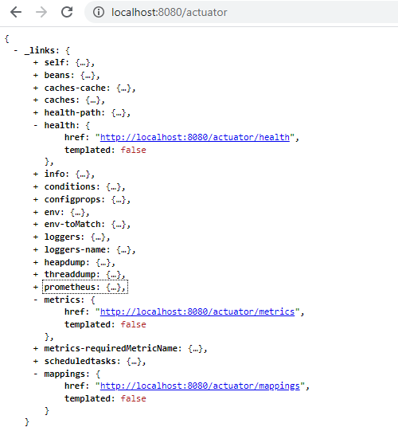
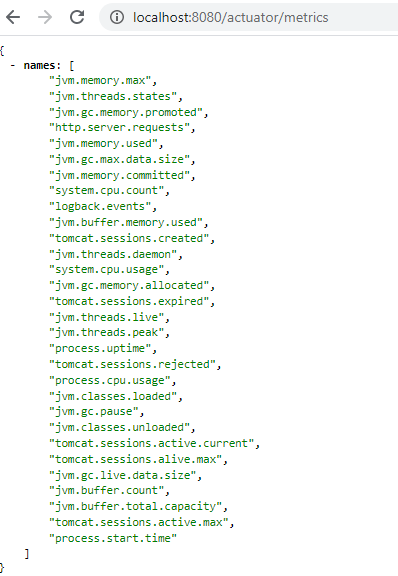
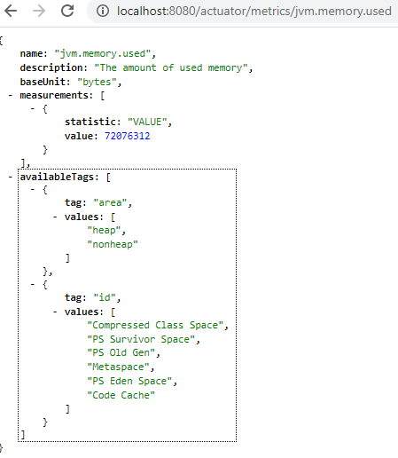
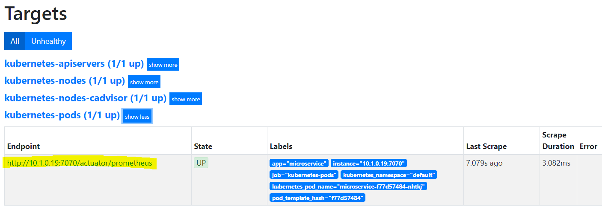
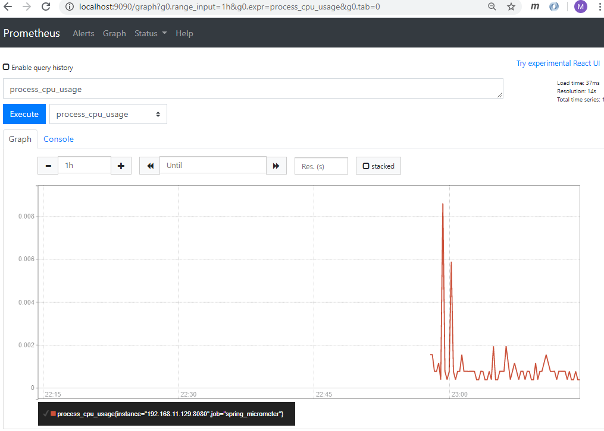
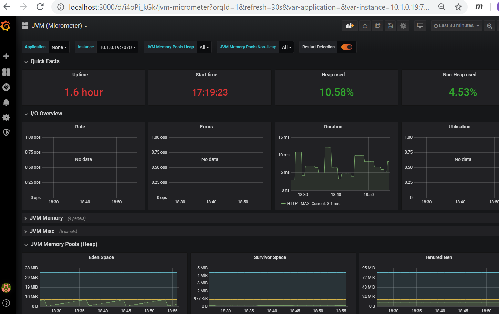

# Lab 05- Logging and Monitoring
---

### Lab Steps

- [Step 1 - Kunernetes Logging](#step-1---kunernetes-logging)
    - [Ensure your application generates logs to streams](#ensure-your-application-generates-logs-to-streams)
    - [Viewing Container Logs](#viewing-container-logs)
    - [Viewing Cluster Events](#viewing-cluster-events)
- [Step 2- Kubernetes Dashboard, Revisited](#step-2--kubernetes-dashboard-revisited)
    - [Deploying the Dashboard UI](#deploying-the-dashboard-ui)
    - [Accessing the Dashboard UI](#accessing-the-dashboard-ui)
    - [Adding metrics to the Dashboard](#adding-metrics-to-the-dashboard)
- [Step 3- Monitoring with Prometheus](#step-3--monitoring-with-prometheus)
    - [What is Prometheus ?](#what-is-prometheus-)
    - [Installing Prometheus with Helm 3](#installing-prometheus-with-helm-3)
    - [Using Prometheus](#using-prometheus)
- [Step 4- Monitoring with Prometheus and Grafana](#step-4--monitoring-with-prometheus-and-grafana)
    - [What is Grafana  ?](#what-is-grafana-)
    - [Installing Grafana with Helm 3](#installing-grafana-with-helm-3)
    - [Configuring and Using Grafana with Prometheus](#configuring-and-using-grafana-with-prometheus)
- [Step 5- Monitoring Spring Boot Applications with Prometheus and Grafana](#step-5--monitoring-spring-boot-applications-with-prometheus-and-grafana)
  - [Setting Up a simple Spring Boot Microservice that exposes metrics](#setting-up-a-simple-spring-boot-microservice-that-exposes-metrics)
  - [Deploying the Spring Microservice in Kubernetes](#deploying-the-spring-microservice-in-kubernetes)
  - [Viewing metrics under Prometheus](#viewing-metrics-under-prometheus)
  - [Visualizing metrics with Grafana](#visualizing-metrics-with-grafana)


# Step 1 - Kunernetes Logging

In this step, you are going to explore the basic techniques for inspecting the logs generated by Kubernetes and containers distributed across your cluster. 

The Kubernetes API has techniques to obtain container runtime engine and Kubernete logs. These are solid techniques for debugging and spot checking. Production level observability includes patterns that use _DaemonSets_ and _Sidecars_ to collect and stream these logs to other data stores optimized for persistence and queries.
  > [Factor 11, Logs, of The Twelve-Factor App](https://12factor.net/logs) states all logs should be treated as event streams.


### Ensure your application generates logs to streams

Let'start a small application that continuously generates log events. 
  > Many thanks to _Vicente Zepeda_ for providing this beautiful simple container `random-logger`. The source code is here:<https://github.com/chentex/random-logger>. This application simply streams logs to stdout with a shell script [echo statement](https://github.com/chentex/random-logger/blob/master/entrypoint.sh). 
- Run the **random-logger** container in a Pod to start generating continuously random logging events
```shell
kubectl create deployment random-logger --image=chentex/random-logger
```
- Scale to three Pods.
  ```shell
  kubectl scale deployment/random-logger --replicas=3
  ```
- Check that the Pods have started.
  ```shell
  kubectl get pods
  ```
- Use the `logs` command and inspect the logs from the container inside the Pod, as part of the deployment.
  ```shell
  kubectl logs deployment/random-logger
  ```
  When logs are requested by deployment/<name> the API randomly chooses only one from the replicated Pods, not all of them. The log it picks is reported at the beginning of the listing, something like `Found 3 pods, using pod/random-logger...`

### Viewing Container Logs

- Getting the logs from a specific Pod 
  - Get the name of the first Pod (This command requires Bash Shell. Please use `Git Bash` for running it)
  ```shell
  POD_0=$(kubectl get pods -o=jsonpath="{.items[0]['metadata.name']}") && echo "Pod name is: $POD_0"
  ```
  - View the logs from that specific Pod by its name.
  ```shell
  kubectl logs $POD_0
  ```
  - To get the logs of all the Pods, use the label selector (--selector or -l).
  ```shell
  kubectl logs --selector app=random-logger
  ```
  - Continuous Stream to Stdout 
    
    Sometimes you may want to observe and application by watching the accumulating log lines. Use the `follow=true | -f `switch to stream the events to stdout.
  ```shell
  kubectl logs --selector app=random-logger --tail=1 --follow=true
  ```
  As the application generates a new log event each second, a new log event will appear. Press `CTRL-C` to break out of the streaming.

- Getting Logs from a Specific Container

  When there is one container in a Pod the log command can't assume to deliver the log from a single container. To see the log from a specific container in a Pod the `-container=<name> | -c=<name>` switch can be used.
  - Start a Pod with two containers.
  ```shell
  kubectl create -f unit4-01-twin-containers.yaml
  ```
  - Try to add a specific container name of the log stream you wish to inspect.
  ```shell
  kubectl logs --selector app=twin -c=container-b
  ```
  If you want all the logs from all the containers, add the `--all-containers=true`. The `--since` switch can be used to get the most recent entries.
  ```shell
  kubectl logs pod/twin --all-containers=true -f --since=3s --timestamps=true
  ```
- Getting Access Logs from Pod's Service

  You can also access the logs from the Service that fronts the Pod. Expose the twin Pod with a Service.
  ```shell
  kubectl expose pod/twin --port=80
  ```
  Access the logs, you still have to specify the specific container when there is more than one.
  ```shell
  kubectl logs service/twin -c=container-a
  ```
- Viewing Logs from Dead Pods
  
  You can use kubectl logs to retrieve logs from a previous instantiation of a container with `--previous` or `-p` flag, in case the container has crashed. If your pod has multiple containers, you should specify which container's logs you want to access by appending a container name to the command.

### Viewing Cluster Events

Events capture all transitions (Create/Retrivieve/Update/Delete) for the cluster objects during their lifecycles. These events are the journal of changes to the cluster, on the control plane. They are stored in etcd and managed by Kubernetes. Kubernetes administrators are interested in these log details to gain insights into cluster resource events.

- View the current namespace events
  
  To see the events related to your activities within the default namespace, use the following command.
  ```shell
  kubectl get events
  ```
- View the kube-system  events
  
  To see the events related happening in `kube-system` namespace, use the following command.

  ```shell
  kubectl get events --namespace=kube-system
  ```
 Because these events accumulate, the older ones are automatically purged. The typical default is one hour, and there is a setting called time-to-live that on some clusters can be adjusted through the kube-apiserver `--event-ttl`. This time is kept short because if too many events accumulate within the time-to-live period, it's possible etcd can overfill. 
 
 Additional tools can stream these events to other channels such as Elasticsearch and persistent data stores.
 
- You can query the events for specific objects by name.
  ```shell
  kubectl get event --field-selector=involvedObject.name=random-logger
  ```
  The same events can be seen at the end of the object's description.
  ```shell
  kubectl describe deployment/random-logger
  ```
- Clean Up. Remove the random-logger Pod and Service
  ```shell
  kubectl delete  deployment/random-logger  po/twin  svc/twin
  ```

# Step 2- Kubernetes Dashboard, Revisited

Kubernetes Dashboard is a general purpose, web-based UI for Kubernetes clusters. 
- You can use Dashboard to get an overview of applications running on your cluster, as well as for creating or modifying individual Kubernetes resources (such as Deployments, Jobs, DaemonSets, etc). 
-  You can use Dashboard to deploy containerized applications to a Kubernetes cluster, troubleshoot your containerized application, and manage the cluster resources. 


### Deploying the Dashboard UI 

The Dashboard UI is not deployed by default. To deploy it, run the following command:

```shell
kubectl apply -f https://raw.githubusercontent.com/kubernetes/dashboard/v2.0.0/aio/deploy/recommended.yaml
```

### Accessing the Dashboard UI 

To protect your cluster data, Dashboard deploys with a minimal authentication by default. Currently, Dashboard only supports logging in with a Bearer Token.  The UI can only be accessed from the machine where the command is executed. 
You can access Dashboard using the kubectl command-line tool by running the following command:

```shell
kubectl proxy
```
Kubectl will make Dashboard available at <http://localhost:8001/api/v1/namespaces/kubernetes-dashboard/services/https:kubernetes-dashboard:/proxy/>.
You will then be prompted with this page, to enter the credentials:


To get the token type in the following command:
```shell
kubectl -n kubernetes-dashboard describe secret default
```
The dashboard UI is then displayed 


### Adding metrics to the Dashboard

[Metrics Server](https://github.com/kubernetes-sigs/metrics-server) collects resource metrics from Kubelets and exposes them in Kubernetes apiserver through Metrics API for autoscaling puposes.  Metrics Server isn't installed by default with Docker Desktop. Follow these steps to install it and configure it.

1. Clone or download the release branch of Metrics Server project. Here is the link : <https://codeload.github.com/kubernetes-sigs/metrics-server/zip/release-0.3>. You can also use the provided version for metrics version. 

2. Open the `deploy/1.8+/metrics-server-deployment.yaml` file in an editor and perform the following changes.
   If you are using the provided version, the configuration required here is already done. Skip to 3.    

    - Change the image as follows:
    ```shell
      image: k8s.gcr.io/metrics-server-amd64:v0.3.1
    ```
    - Add the `–kubelet-insecure-tls` argument into the existing `args` section. That section will look like the following once you're done:
    ```shell
    args:
      - --cert-dir=/tmp
      - --secure-port=4443
      - --kubelet-insecure-tls
    ```
3. Apply all the yaml files from the installation folder of metrics server, to create the deployment, services, etc.
    ```shell
    kubectl create -f deploy/1.8+/
    ```
4. You should now be able to run kubectl `top` commands!
    ```shell
    kubectl get pods -n kube-system
    ```
5. Refresh the Kubernetes Dashboard, you will now see the metrics.
    


# Step 3- Monitoring with Prometheus

Monitoring an application is absolutely required if we want to anticipate problems and have visibility of potential bottlenecks in a dev or production deployment. To help monitor the cluster and the many moving parts that form a deployment, Kubernetes ships with tools for monitoring the cluster:
- Liveness and Readiness Probes: actively monitor the health of a container. If the probe determines that a container is no longer healthy, the probe will restart it.
- cAdvisor is an open source agent that monitors resource usage and analyzes the performance of containers. Originally created by Google, cAdvisor is now integrated with the Kubelet. It collects, aggregates, processes and exports metrics such as CPU, memory, file and network usage for all containers running on a given node.

Monitoring a Kubernetes cluster(s) is a challenging objective. The Kubernetes API and the kube-metrics-server solve part of this problem by exposing Kubernetes internal data such as number of desired / running replicas in a deployment, unschedulable nodes, etc. The use of monitoring tools like Prometheus ang Grafana is required in order to set up a complete monitoring solution.    

### What is Prometheus ?

**[Prometheus](https://prometheus.io/)**, a [Cloud Native Computing Foundation project](https://cncf.io/), is a systems and service monitoring system. It collects metrics from configured targets at given intervals, evaluates rule expressions, displays the results, and can trigger alerts if some condition is observed to be true.

Prometheus consists of the following core components -
- A data scraper that pulls metrics data over HTTP periodically at a configured interval.
- A time-series database to store all the metrics data.
- A simple user interface where you can visualize, query, and monitor all the metrics.

The data needs to be appropriately exposed and formatted so that Prometheus can collect it. Prometheus can access data directly from the app's client libraries or by using exporters. We still need to inform Prometheus where to look for that data. Prometheus discovers targets to scrape from by using Service Discovery.

The Kubernetes cluster already has labels and annotations and an excellent mechanism for keeping track of changes and the status of its elements. Hence, Prometheus uses the Kubernetes API to discover targets.

The Kubernetes service discoveries that you can expose to Prometheus are: node, endpoint, service,pod, and ingress.

Prometheus retrieves machine-level metrics separately from the application information. The only way to expose memory, disk space, CPU usage, and bandwidth metrics is to use a node exporter. Additionally, metrics about cgroups need to be exposed as well.

Fortunately, the cAdvisor exporter is already embedded on the Kubernetes node level (in Kubelets precisely) and can be readily exposed.


### Installing Prometheus with Helm 3

Prometheus monitoring can be installed on a Kubernetes cluster by using a set of YAML (Yet Another Markup Language) files. These files contain configurations, permissions, and services that allow Prometheus to access resources and pull information by scraping the elements of your cluster.

Helm Hub provides a chart that performs a Prometheus deployment on a Kubernetes cluster using the Helm package manager. This chart is provided here <https://hub.helm.sh/charts/stable/prometheus>.

- Let's first create a separate namespace called `monitoring` the hold the Prometheus artifacts.
```shell
kubectl create ns monitoring
```
- Add the charts repository to helm and update the repo.
  ```shell
helm repo add stable https://kubernetes-charts.storage.googleapis.com/
helm repo update
```
- Install the latest stable chart of prometheus within the `monitoring` namespace
```shell
helm install prometheus stable/prometheus --namespace monitoring
```
- Connect to the Prometheus Web UI:
  Once the deployment finishes, the chart will give some indications on how to access the Web UI.
  
  - Extract the Prometheus Pod name:
  ```
  export POD_NAME=$(kubectl get pods --namespace monitoring -l "app=prometheus,component=server" -o jsonpath="{ .items[0].metadata.name}")
  ```
  - Enable the access to the Prometheus Pod through `port-forwarding` to the local port `9090`.
    ```shell
    kubectl --namespace monitoring port-forward $POD_NAME 9090
    ```
  - Launch your browser and open the URL:  <http://localhost:9090>. You will get the following Web page
    

  - Open the URL <http://localhost:9090/metrics> to see all the metris scrapped by Prometheus. Refresh that URL and see that the values change.
  
### Using Prometheus 

The Web interface provides access to the local Prometheus server and the associated parameters and monitoring options. It allows us to see the connected modules and the overall status of the server.


You can view all the targets: 


Also, this interface supports using predefined metrics and custom queries with PromQL.

- Let's show the value of the all-time time series with the counter metric `prometheus_http_requests_total`. This will show us all of the data denoted by this metric name, or "key".
 
  

# Step 4- Monitoring with Prometheus and Grafana

### What is Grafana  ?

[Grafana](https://grafana.com/)  is open source visualization and analytics software. It is the leading graph and dashboard builder for visualizing time series infrastructure and application metrics.

Grafana  allows you to query, visualize, alert on, and explore your metrics no matter where they are stored. Data can be collected from various data sources like Elasticsearch, Prometheus, Graphite, InfluxDB etc. Grafana lets you set alert rules based on your metrics data. When an alert changes state, it can notify you over email, slack, or various other channels. Prometheus dashboard also has simple graphs. But Grafana’s graphs are way better.

### Installing Grafana with Helm 3

- Install the latest stable chart of Grafana within the `monitoring` namespace
```shell
helm install my-grafana --set admin.user=admin --set admin.password=password bitnami/grafana --namespace monitoring
```
  - In this installation, the administrator is set to `admin` and its password is set to `password`. These parameters are useful to get connected to the Grafana dasbord later.  

- Enable the access to the Grafana Pod through `port-forwarding` to the local port `3000`.
    ```shell
    kubectl --namespace monitoring port-forward svc/my-grafana 3000
    ```  
- Launch your browser and open the URL:  <http://localhost:3000>. You will get the following Web page
    

  Login using the username `admin` and password `password`.

### Configuring and Using Grafana with Prometheus

The Grafana configuration wizard is displayed when you login successfully.


- **Adding Prometheus as a Grafana DataSource**
    We configure Grafana to access your Prometheus server as a data source. Each Prometheus server is a separate data source, and if you are configuring more than one Prometheus server, repeat this section for each.
   
    Since Grafana works with many data sources, we need to define which one we're relying on. Select Prometheus as your data source:
    
    

    Now, add the URL that Prometheus is running on, in our case `http://<prometheus_pod_id>:9090` and select Access to be through a browser.

     - To determine the `prometheus_pod_id`, run `kubectl describe pod $POD_NAME -n monitoring | grep IP`
       $POD_NAME is the Promotheus POD_NAME (See the previous section).
    
    Click Add to add your data source, and then click Test Connection to verify everything is working properly. If successful, move on to the next step to import your dashboard.

- **Importing the Prometheus Stats Dashboard**
   
   In this task, we download an official, pre-built Prometheus Dashboard. There are a lot of exusting dashboards available here <https://grafana.com/grafana/dashboards>.

   We import here this Dashboard : [Kubernetes cluster monitoring (via Prometheus)](https://grafana.com/grafana/dashboards/315). Navigate to the dashboard link and copy its Dashboard Id. Then, specify that ID when importing the dashboard into Grafana.

    - Right click and save the following link: [)
Navigate your browser directly to the dashboard JSON file: http://grafana.org/assets/dashboards/prometheus-dash.json.   The dashbord layout looks like the following.
     

- **Analyzing the Data from the Prometheus Dashboard**

  For a newly running Prometheus server, your graphs should appear pretty flat and small.

  Long term, these graphs will vary greatly depending on your particular use case and workloads. In general, you want all of these graphs to remain stable. If more targets are being scraped and/or they start exporting more metrics, the number of ingested samples, memory series, and target scrapes per second will increase — that is to be expected.

  If your target scrapes drop unexpectedly or the scrape latency goes up, you should determine the cause. For example, a client can start exporting 1 million metrics instead of the usual 10 thousand metrics or someone can export a time series with a different label for each user. Both of these would cause an increase in scrape latency. So, when a graph suddenly goes up, you should investigate whether an application was just scaled up significantly or whether it might be instrumented badly.


# Step 5- Monitoring Spring Boot Applications with Prometheus and Grafana

## Setting Up a simple Spring Boot Microservice that exposes metrics

We develop here a simple Spring Boot Microservice application that provides a REST Endpoint `/hello` that runs on the default port `7070`. This application also has the `spring-boot-starter-actuator` dependency, which provides production-ready endpoints that you can use for your application. These endpoints fall under a common prefix of `/actuator` and are, by default, protected.

Expose them individually, or all at once, by adding the following properties in `application.properties`:
```shell
management.endpoints.web.exposure.include=*
```
The microservice uses `Micrometer` utility in order to exposes `/actuator/metrics` data into something your monitoring system can understand. Micrometer is a separate open-sourced project. It is added as a dependency in `pom.xml`. 
```xml
<dependency>
    <groupId>io.micrometer</groupId>
    <artifactId>micrometer-registry-prometheus</artifactId>
</dependency>
```
The docker image of the microservice is available on DockerHub. This is its tag `mromdhani/my-monitoring-app:1.0`

- Let's start the microservice using docker and  test quickly the actuator endpoints:
  ```
  docker docker run -p 8080:7070 mromdhani/my-monitoring-app:1.0
  ```
  To check, let's navigate our browser to http://localhost:8080/actuator:

  

  You can see all the endpoints that Actuator exposes such as `/health`, `/metrics`, `/mappings`, etc. Let's open up the /metrics endpoint of the Actuator by navigating our browser to `http://localhost:8080/actuator/metrics`:

  

  As you can see, there's a bunch of information about our application here, such as information about threads, Tomcat sessions, classes, the buffer, etc. Let's go deeper and retrieve information about the JVM memory used:

  

  Stop the docker container. 
  ```
  docker rm -f $(docker ps -ql)
  ```

## Deploying the Spring Microservice in Kubernetes

- Create a YAML deployment named `unit5-01-spring-microservice.yaml` and initialize it as follows:
  ```yaml
    apiVersion: apps/v1
    kind: Deployment
    metadata:
      generation: 1
      labels:
        app: microservice
      name: microservice
    spec:
      replicas: 1
      selector:
        matchLabels:
          app: microservice
      strategy:
        rollingUpdate:
          maxSurge: 1
          maxUnavailable: 1
        type: RollingUpdate
      template:
        metadata:
          labels:
            app: microservice
          annotations:
            prometheus.io/scrape: "true"
            prometheus.io/port: "7070"
            prometheus.io/path: "/actuator/prometheus"
        spec:
          containers:
          - name: microservice
            env:
            - name: JAVA_OPTS
              value: -Xmx256m -Xms256m
            image: mromdhani/my-monitoring-app:1.0
            imagePullPolicy: IfNotPresent
            ports:
            - containerPort: 7070
              protocol: TCP
            resources:
              limits:
                memory: 294Mi
            livenessProbe:
              failureThreshold: 3
              httpGet:
                path: /actuator/health
                port: 7070
                scheme: HTTP
              initialDelaySeconds: 45
              periodSeconds: 10
              successThreshold: 1
              timeoutSeconds: 5
            readinessProbe:
              failureThreshold: 5
              httpGet:
                path: /actuator/health
                port: 7070
                scheme: HTTP
              initialDelaySeconds: 30
              periodSeconds: 10
              successThreshold: 1
              timeoutSeconds: 5
    ```
  These annotations in the YAML are required for Prometheus to scrape our actuator endpoints.  
    ```yaml
   prometheus.io/scrape: "true"
   prometheus.io/port: "7070"
   prometheus.io/path: "/actuator/prometheus"
  ```            
- Deploy the microservice
  ```shell
  $ kubectl apply-f unit5-01-spring-microservice.yaml
  ```
##  Viewing metrics under Prometheus

- To check if Prometheus is actually listening to the Spring app, you can go to the `/targets` endpoint:
  
  

- Let's go back to the home page and select a metric (`process_cpu_usage` for example)from the list and click Execute:

 

## Visualizing metrics with Grafana
While Prometheus does provide some crude visualization, Grafana offers a rich UI where you can build up custom graphs quickly and create a dashboard out of many graphs in no time. You can also import many community built dashboards for free and get going.

Grafana can pull data from various data sources like Prometheus, Elasticsearch, InfluxDB, etc. It also allows you to set rule-based alerts, which then can notify you over Slack, Email, Hipchat, and similar.

As previously said, Grafana has a ton of pre-built dashboards. Import a new dashboard for Spring Boot projects. Let's pick the [JVM dashboard](https://grafana.com/grafana/dashboards/4701) which is popular.

Input the URL for the dashboard, select "Already created Prometheus datasource" and then click Import:
